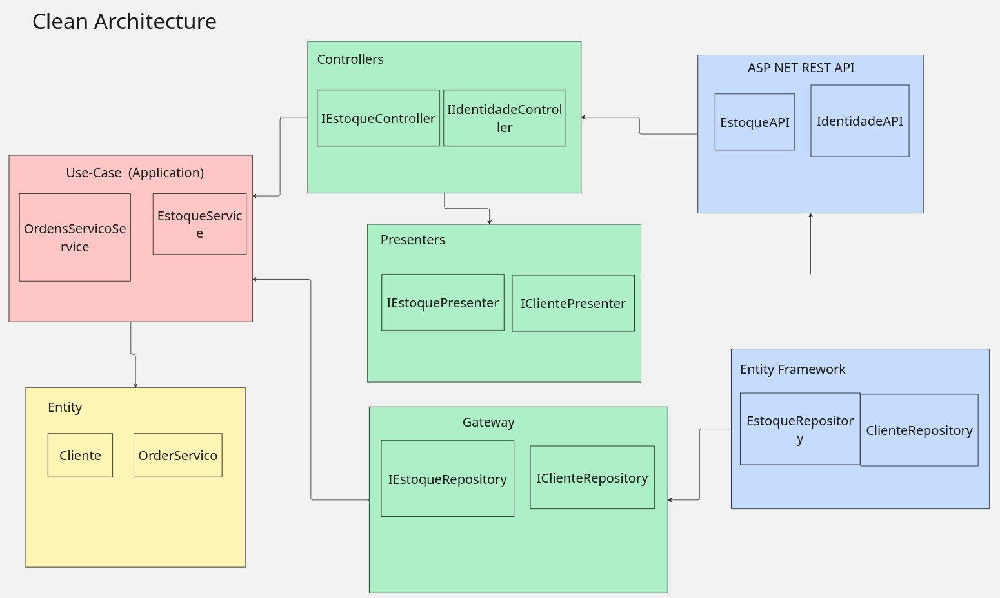
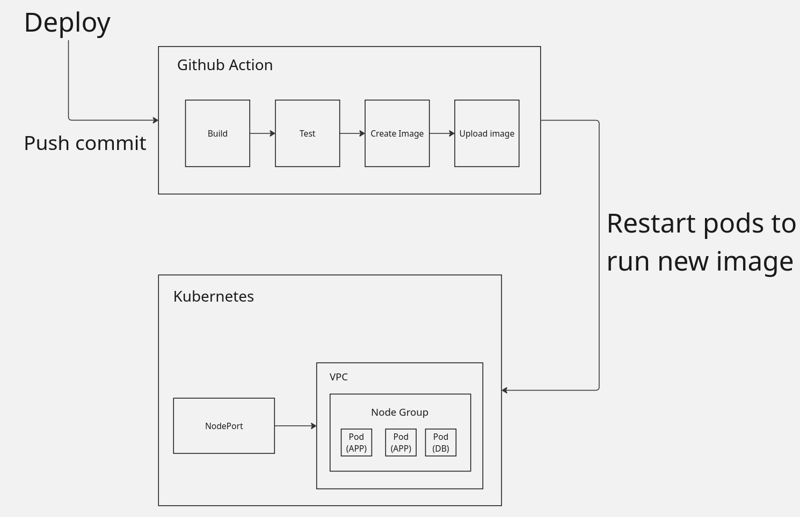

## Fase 2
Nesta fase o código foi refatorado para estar de acordo com clean architecture.
Foi adicionado k8s para poder rodar a aplicação com kubernetes (no momento configurado pra rodar com minikube).
Também foi adicionado scripts terraform para rodar a aplicação no kubernetes (também só roda com minikube).
Foi adicionado workflows para rodar CI/CD no github. Nele, temos o step de build da aplicação,
rodamos testes unitarios e de integração. Depois é gerado a imagem e então fazemos o upload dela no dockerhub

## clean arch:
A aplicação na fase 1 ja estava bem de acordo com clean arch.
- A camada de aplicação a meu ver já está de acordo com use case apresentado nas aulas de clean arch.
- Os gateways também já estavam corretos, o gateway são as interfaces de repositorios
definidos na camada de entidade. A implementação dos repositories na camada de 
- Para as APIs do ASP NET, poderia haver uma refatoracao para desacoplar o framework dos controllers
da aplicacao, mas na minha opiniao, nao ha ganho nenhum em fazer isso, pois nao acho que ha possibilidades
de mudar do asp net para outra coisa.

-- Caso houvesse um motivo forte para refatorar os controllers, seria feito assim:
O controller teria uma interface que a camada de Framework iria utilizar. A Interface teria definido o output e o input,
esse é o contract que a camada externa iria utilizar. A implementacao de controller possui um Presenter que converte o
output da camada de Use Case para o output definido na interface de controller. 

## Componentes:
- A aplicação atualmente roda uma api em asp net e um banco de dados postgresql.
  Temos os yaml para rodar os dois no kubernetes (minikube) e temos a opção de rodar
  via terraform apply

## k8s
- configmap.yaml (variaveis de ambiente)
- deployment.yaml  (deployment da aplicacao)
- hpa.yaml (auto scaling)
- kustomization.yaml (lista dos yaml que tem que rodar)
- namespace.yaml (namespace para todos os yaml)
- postgres-deployment.yaml (deployment do postgres)
- postgres-pvc.yaml (pvc para postgres)
- postgres-service.yaml (porta interna postgres )
- secret.yaml (variaveis secrets)
- service-externo.yaml (nodeports para acessar de fora)
- service-interno.yaml (porta interna da aplicacao)

## terraform:
- README.md
- api.tf            contem deployment, services (clusterip e nodeports), health check
- configmap.tf     - variaveis de ambiente
- hpa.tf           - auto scaling com maxreplica 3
- namespace.tf     - namespace de tudo (gashu-app)
- postgres.tf      - postgres usado pelo api.tf. (deployment, pvc, services)
- providers.tf     - configuração para conectar com kubernetes (minikube)
- provision.sh     - script pra rodar o terraform e provisionar tudo
- secret.tf        - secrets (password e etc)
- terraform.tfvars - todos os defaults das variaveis
- variables.tf     - todas variaveis usadas nos scripts
- versions.tf      - define versoes do terraform e kubernetes para usar

- github actions
No momento, o workflow executa o build toda vez que tem push no repositorio,
ele builda, executa os testes, depois gera uma imagem e sobe essa imagem para o dockerhub

## execucao local
- cd sistema-mecanica
- docker compose up

## deploy kubernetes (local)
- minikube start
- cd sistema-mecanica
- kubectl apply -k k8s/

## provisionamento terraform (local)
- minikube start
- cd sistema-mecanica/infra
- settar terraform.tfvars (eu ja deixei configurado no repositorio. Sim, nao eh seguro, deixei mesmo assim)
- terraform init
- terraform apply

## Fase 1

## Para rodar:
cd no root do projeto  
docker build -t sistema-mecanica .  
docker compose up  

## Setup:
O sistema necessita de algumas variáveis de ambientes. Vou colocar aqui como eu configurei pra rodar local  
export FIAP_POS_PORT=8080  
export FIAP_POS_EMAIL=kenjigashu@gmail.com  
export FIAP_POS_APP_PASSWORD=iotjahrsjmogmdyc  
export FIAP_POS_SALT=pesomorto  
export FIAP_POS_SECRET=minha_chave_super_secreta_com_32_chars!!  

## arquivo de coverage
tests/coverage-report/index.html  

## console app
console_app/apicall  

## sonarqube report
jsons salvos em sonarqube/reports/metrics.json e sonarqube/reports/vulnerabilities.json  

## Documentações
C4 - docs/C4_Parte1.drawio.png  
   - docs/miroLink.org  
Event Storming - https://miro.com/app/board/uXjVGkR23w0=/  
ADR Escolha banco de dados - docs/ADR_escolha_bancoDeDados.org  

## Comando para colocar coverage no sonarqube
dotnet sonarscanner begin /k:"fiap-pos"  /d:sonar.cs.opencover.reportsPaths="**/coverage.opencover.xml"   /d:sonar.login="TOKEN" /d:sonar.host.url="http://localhost:9000"  
dotnet build  
dotnet test /p:CollectCoverage=true /p:CoverletOutputFormat=opencover  
dotnet sonarscanner end /d:sonar.login="TOKEN"  
